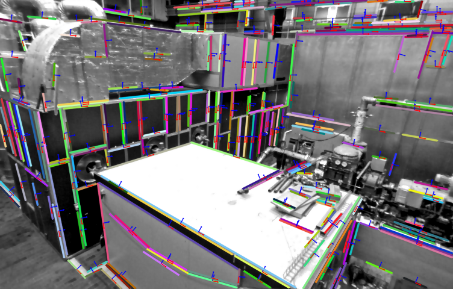

# EDLine Parallel
A parallel implementation of EDLine algorithm which based on the `Line Segment Detector` module of [opencv_contrib](https://github.com/opencv/opencv_contrib). Compared to the original version, the parallel one results in a almost 50% time reduction on PC with 4 cores CPU.

Related project: [Line Matching](https://github.com/HanjieLuo/line_matching)



## Requirements ##
The code is tested on Ubuntu 14.04. It requires the following tools and libraries: CMake, OpenCV 3.4. 

## Building ##

```
#!bash

cd EDLine_parallel
mkdir build
cd build
cmake  ..
make
```

Test:

```
#!bash
./bin/test_edline_detector
```

## Contact information ##
Hanjie Luo [luohanjie@gmail.com](mailto:luohanjie@gmail.com)
